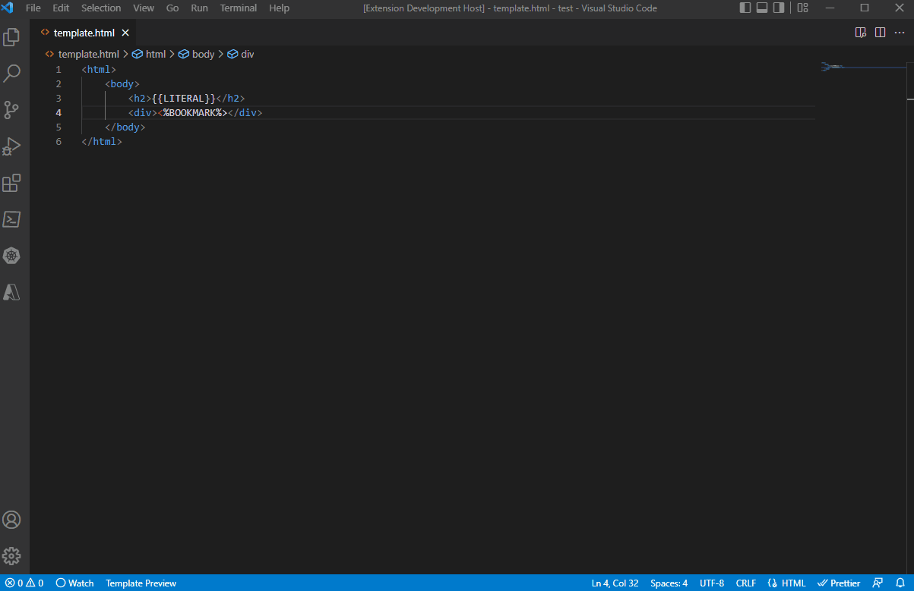
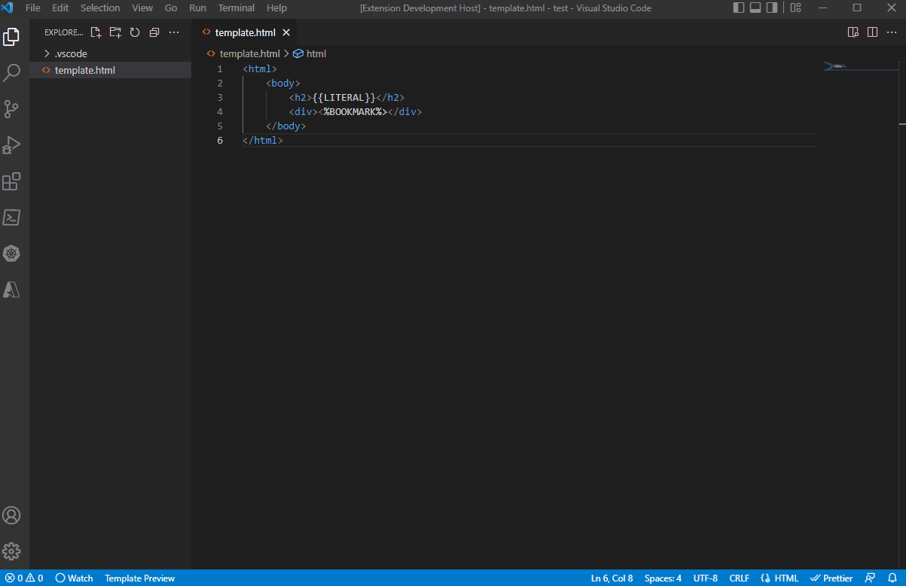

# Autodocs VS Code Support

This is the extension that enables preview of Autodocs templates used in Siebel.

## Features

### Template Preview
It's possible to preview Autodocs templates and modify them on the fly:

### Sample File Generation
There is a handy option to generate sample file for further modification: 
